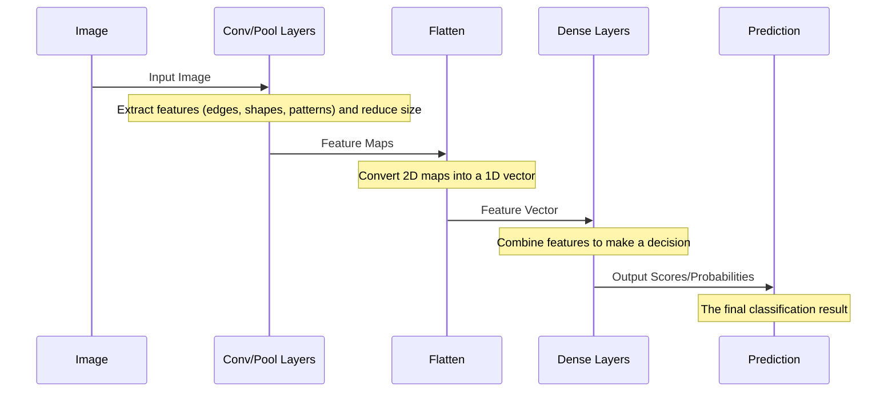

# Chapter 1: CNN Model Architecture

Welcome to the first chapter of our tutorial on building a brain tumor classification project! In this chapter, we'll dive into the core "brain" of our project: the **Convolutional Neural Network (CNN)** model. Think of the CNN as the part of our system that will learn to look at images of brain scans and figure out if they show a tumor, and if so, what kind.

## What is a CNN?

Imagine you want to teach a child to recognize a specific animal in pictures, say, a cat. You'd point out features: "See the pointy ears? The whiskers? The tail?" The child learns to combine these simple features to recognize a cat.

A CNN works similarly, but for computers looking at images. It's a special type of neural network that's really good at processing grid-like data, like the pixels in an image. Instead of just looking at every pixel individually, it looks for patterns and features in local areas of the image, just like we look for ears and whiskers on a cat.

## Building Blocks of a CNN Architecture

A CNN is built by stacking different types of layers, each with a specific job. Let's look at the main ones we'll use in our model:

### 1. Convolutional Layers (Conv2D)

*   **What they do:** These are the heart of a CNN. They scan the image using small "filters" (also called kernels) to detect patterns like edges, corners, or textures.
*   **Analogy:** Like using a magnifying glass to look for specific patterns in different parts of a picture. Each filter looks for a *specific* type of pattern.

```python
# Example: A simple Convolutional Layer
# Looks for patterns using 32 different 3x3 filters
model.add(Conv2D(32, kernel_size=(3, 3), input_shape=(150, 150, 3), padding='Same'))
# input_shape=(height, width, channels) - 150x150 pixels, 3 channels for color (RGB)
# padding='Same' helps keep the size consistent
```
*   **Explanation:** This code adds a layer that applies 32 different filters (each 3x3 pixels in size) across the input image. The `input_shape` tells the network the size of the images it expects.

### 2. Activation Functions (like ReLU)

*   **What they do:** After a convolutional layer detects patterns, an activation function decides *if* that pattern is "important" or "activated." They introduce non-linearity, which helps the network learn complex relationships.
*   **Analogy:** It's like a switch that turns on only if the detected pattern is strong enough.
*   **ReLU (Rectified Linear Unit):** A common activation that outputs the value directly if it's positive, otherwise it outputs zero. Simple and effective.

```python
# Example: Adding a ReLU activation after a Conv layer
model.add(Conv2D(32, kernel_size=(3, 3), activation='relu', padding='Same'))
# The activation='relu' applies the ReLU function to the output of this layer
```

### 3. Pooling Layers (MaxPooling2D)

*   **What they do:** These layers reduce the size of the image representation (the output of the convolutional layers) while keeping the most important information. This makes the network faster and helps it focus on the most relevant features.
*   **Analogy:** Like summarizing a long paragraph by picking out only the most important sentences.
*   **MaxPooling:** A common type that takes the maximum value from small areas (e.g., 2x2 pixels).

```python
# Example: A MaxPooling Layer
# Reduces size by taking the max value in each 2x2 window
model.add(MaxPooling2D(pool_size=(2, 2)))
```
*   **Explanation:** This layer reduces the spatial dimensions (height and width) of the data it receives by selecting the maximum value within each 2x2 grid cell. This helps make the model more robust to small shifts in the image.

### 4. Batch Normalization

*   **What they do:** This layer helps stabilize and speed up the training process. It normalizes the outputs of a layer before passing them to the next layer.
*   **Analogy:** Like making sure all students start the exam with similar background knowledge so the test results accurately reflect what they learned *during* the course, not before.

```python
# Example: Adding Batch Normalization
model.add(BatchNormalization())
# Typically placed after a convolutional or dense layer and before activation or pooling
```

### 5. Dropout Layers

*   **What they do:** Dropout is a technique to prevent overfitting. During training, it randomly "turns off" a percentage of neurons in a layer.
*   **Analogy:** Like making random students in a class explain concepts – this prevents the "smartest" students from doing all the work and forces the others to learn as well. The network becomes more robust.

```python
# Example: A Dropout Layer
# Randomly turns off 25% of the neurons
model.add(Dropout(0.25))
```
*   **Explanation:** This layer randomly sets 25% of the outputs from the previous layer to zero during training. This forces the network to learn redundant representations and reduces reliance on specific neurons.

### 6. Dense (Fully Connected) Layers

*   **What they do:** These layers take all the features learned by the convolutional and pooling layers and use them to make the final classification decision. Every neuron in a dense layer is connected to every neuron in the previous layer.
*   **Analogy:** The teacher taking all the summarized information from the class discussion (the features) and using it to make a final decision about which animal is in the picture (the tumor type).
*   **Output Layer:** The very last dense layer has one neuron for each possible category (e.g., Glioma, Meningioma, Pituitary, No Tumor). It often uses a **Softmax** activation function, which turns the outputs into probabilities that sum up to 1.0.

```python
# Example: Dense Layers and the final output layer
model.add(Dense(512, activation='relu')) # A hidden dense layer
model.add(Dense(3, activation='softmax')) # The final output layer (3 classes in this example)
```
*   **Explanation:** The first dense layer takes the flattened features and processes them through 512 neurons with ReLU activation. The final dense layer has 3 neurons (one for each tumor type the model predicts in this specific code snippet) and uses Softmax to output the probability of the image belonging to each class.

### 7. Flatten Layer

*   **What it does:** Convolutional and pooling layers output 2D (or 3D, with channels) data. Dense layers expect 1D data. The Flatten layer converts the 2D output of the last pooling/conv layer into a single long vector.
*   **Analogy:** Stacking all your summarized paragraphs one after another into a single list.

```python
# Example: A Flatten Layer
model.add(Flatten())
# Placed before the first dense layer
```

## Putting the Architecture Together

In Keras, we can build a CNN by creating a `Sequential` model and adding layers one by one. Let's look at the model definition from the code ([`classification.py`](classification.py) or [`compiled_layered_model.ipynb`](compiled_layered_model.ipynb)):

```python
model = Sequential()

model.add(Conv2D(32, kernel_size=(2, 2), input_shape=(150, 150, 3), padding = 'Same'))
model.add(Conv2D(32, kernel_size=(2, 2),  activation ='relu', padding = 'Same'))

model.add(BatchNormalization())
model.add(MaxPooling2D(pool_size=(2, 2)))
model.add(Dropout(0.25)) # Note: In one snippet this is commented, in the other it's included. We'll follow the notebook.

model.add(Conv2D(64, kernel_size = (2,2), activation ='relu', padding = 'Same'))
model.add(Conv2D(64, kernel_size = (2,2), activation ='relu', padding = 'Same'))

model.add(BatchNormalization())
model.add(MaxPooling2D(pool_size=(2,2), strides=(2,2)))
model.add(Dropout(0.25))

model.add(Flatten())

model.add(Dense(512, activation='relu'))
model.add(Dropout(0.5)) # Note: In one snippet this is commented, in the other it's included.
model.add(Dense(3, activation='softmax')) # Note: The code predicts 3 classes here, not 4 like the labels list. This is likely a variation.
```
*   **Explanation:** This code defines a CNN with several layers. It starts with convolutional layers to extract features, followed by batch normalization and pooling to improve training and reduce size. Dropout is added to prevent overfitting. The `Flatten` layer prepares the data for the dense layers, which perform the final classification. The last `Dense` layer with `softmax` outputs the probabilities for each tumor type.

After defining the layers, you often use `model.summary()` to see the model's structure and the number of parameters (weights and biases) it needs to learn:

```python
print(model.summary())
```

*   **Explanation:** This will print a table showing each layer, the shape of its output, and the number of parameters it adds to the model. It's a great way to get an overview of the architecture you've built. You'll see the output dimensions shrinking after pooling layers and the parameter count increasing significantly in the dense layers.

## How the CNN Processes an Image (High-Level Flow)

When you give an image to this CNN, it goes through the layers like this:



*   **Explanation:** The image enters the network and passes through the convolutional and pooling layers, which work together to find and simplify the important visual information (features). The `Flatten` layer then prepares these features for the `Dense` layers, which act like a decision-making unit. Finally, the `Prediction` is the model's output, telling us the likelihood of the image belonging to each category.

## Why This Architecture for Brain Tumors?

CNNs are particularly well-suited for image classification because they automatically learn hierarchical features directly from the pixels. The early layers learn simple features, and deeper layers combine these to learn more complex ones (like the shape of a tumor). The structure of stacked convolutional and pooling layers is a standard and effective pattern for tasks like identifying objects (or tumors!) in images. The additional layers like Batch Normalization and Dropout are common techniques to make the training process more stable and reliable.

## Conclusion

In this chapter, we learned about the fundamental building blocks of a CNN and how they are assembled to create an architecture capable of processing images and learning visual features. We saw how layers like Convolutional, Pooling, Batch Normalization, Dropout, Flatten, and Dense layers work together to form the "brain" of our image classification model.

Now that we understand the model's structure, the next crucial step is to prepare the images it will learn from. We'll cover that in the next chapter.

[Dataset Preparation](02_dataset_preparation_.md)
