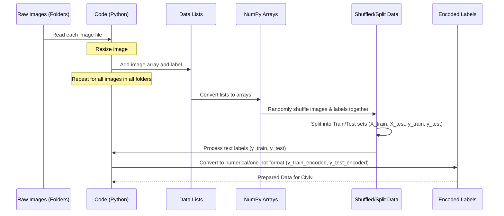

# Chapter 2: Dataset Preparation

Welcome back! In [Chapter 1: CNN Model Architecture](01_cnn_model_architecture_.md), we learned about the "brain" of our project – the Convolutional Neural Network (CNN). We saw how it's built with different layers to recognize patterns in images. But just like a student needs textbooks to learn, our CNN needs data!

The images of brain scans are our "textbooks". However, these images come in different sizes, formats, and aren't immediately in a format that a neural network can easily understand. This is where **Dataset Preparation** comes in.

## What is Dataset Preparation?

Think about trying to teach a student using a pile of mixed-up books: some are too big, some too small, pages are out of order, and some don't have clear chapter titles. It would be hard for the student to learn!

Dataset preparation is the process of organizing, cleaning, and transforming our raw image data into a consistent, structured format that is ready for the CNN to consume and learn from. For our brain tumor classification project, this means taking all the brain scan images from different folders (like 'glioma\_tumor', 'no\_tumor', etc.) and getting them ready.

Our main goal is to turn the images and their labels (the type of tumor, or no tumor) into numerical arrays that Keras and TensorFlow can work with.

## Getting the Data Ready: The Steps

The process involves several key steps:

1.  **Loading Images:** Reading the image files from their storage location (like folders on your computer or disk).
2.  **Resizing:** Making sure all images have the *exact* same height and width. CNNs need fixed-size inputs.
3.  **Organizing with Labels:** Linking each image to its correct label (e.g., this image shows a 'Glioma' tumor).
4.  **Shuffling:** Randomly mixing the order of the images. This is important so the network doesn't learn based on the order of data.
5.  **Splitting:** Dividing the prepared data into two main groups: one for **training** (what the CNN learns from) and one for **testing** (what we use to check how well the CNN learned).
6.  **Converting Labels:** Turning the text labels (like 'Glioma') into numbers that the CNN can process, often using a technique called "one-hot encoding".

Let's look at how we might implement these steps based on the project code.

## Implementing Data Preparation (Simplified)

The project code ([`compiled_layered_model.ipynb`](compiled_layered_model.ipynb) or [`classification.py`](classification.py)) reads images from structured folders like `Training/glioma_tumor`, `Testing/no_tumor`, etc.

Here's a simplified look at how the images are loaded, resized, and paired with their labels:

```python
import cv2 # OpenCV library for image processing
import os  # Module for interacting with the operating system

# Define the labels (the classes of tumors we want to classify)
labels = ['glioma_tumor','meningioma_tumor','pituitary_tumor'] # Note: Example uses 3 classes

# Define the size we want to resize all images to
IMAGE_SIZE = 150

# Lists to hold our images (X) and their corresponding labels (y)
X_data = []
y_data = []

# --- Loading Training Data ---
print("Loading Training Data...")
for label in labels:
    # Construct the path to the folder for this label's training images
    folder_path = os.path.join('D:/PBS/labelled Dataset', 'Training', label)
    # Loop through all files in the folder
    for file_name in os.listdir(folder_path):
        # Construct the full path to the image file
        img_path = os.path.join(folder_path, file_name)
        # Read the image file using OpenCV
        img = cv2.imread(img_path)
        # Resize the image to the standard size
        img = cv2.resize(img, (IMAGE_SIZE, IMAGE_SIZE))
        # Add the processed image to our data list
        X_data.append(img)
        # Add the corresponding label to our label list
        y_data.append(label)

# --- Loading Testing Data ---
print("Loading Testing Data...")
# Repeat the process for the testing data folders
for label in labels:
    folder_path = os.path.join('D:/PBS/labelled Dataset', 'Testing', label)
    for file_name in os.listdir(folder_path):
        img_path = os.path.join(folder_path, file_name)
        img = cv2.imread(img_path)
        img = cv2.resize(img, (IMAGE_SIZE, IMAGE_SIZE))
        X_data.append(img)
        y_data.append(label)

# At this point, X_data is a list of image arrays, and y_data is a list of their labels.
# (Note: The original code also includes augmentation during loading, which we'll cover in Chapter 3)
```
*   **Explanation:** This code iterates through the folders for each tumor type (`labels`) in both the 'Training' and 'Testing' directories. For every image file found (`os.listdir`), it constructs the full file path (`os.path.join`), reads the image into a numerical array using `cv2.imread`, resizes it to 150x150 pixels using `cv2.resize`, and appends the image array to `X_data` and its corresponding text label to `y_data`.

### Shuffling and Splitting

Once all images and labels are loaded, we have two lists, `X_data` and `y_data`. Before training, it's crucial to shuffle and split this combined dataset.

```python
import numpy as np # NumPy for numerical operations
from sklearn.utils import shuffle # For shuffling data
from sklearn.model_selection import train_test_split # For splitting data

# Convert lists to NumPy arrays (required for shuffling and splitting)
X_data = np.array(X_data)
y_data = np.array(y_data)

# --- Shuffling Data ---
# Randomly shuffle the images and their labels together
X_data, y_data = shuffle(X_data, y_data, random_state=101)
# random_state ensures the shuffling is the same each time for reproducibility

# --- Splitting Data ---
# Split the data into training (90%) and testing (10%) sets
# The split is done *after* combining and shuffling so both sets are representative
X_train, X_test, y_train, y_test = train_test_split(
    X_data, y_data, test_size=0.1, random_state=101
)
# test_size=0.1 means 10% of the data goes to the testing set
```
*   **Explanation:** We convert our lists to NumPy arrays because libraries like scikit-learn (which `train_test_split` comes from) and deep learning frameworks work efficiently with arrays. We then use `shuffle` to randomize the order of images and labels, ensuring no bias is introduced from the original folder structure. Finally, `train_test_split` divides the dataset into `X_train` (images for training), `y_train` (labels for training), `X_test` (images for testing), and `y_test` (labels for testing). The `random_state` here also helps ensure the split is consistent across runs.

### Converting Labels to Numbers

Neural networks work with numbers. Our labels are currently text strings (like 'glioma\_tumor'). We need to convert these into a numerical format. For classification, a common technique is **one-hot encoding**.

In one-hot encoding, each category is represented by a vector (a list of numbers) where only one position is 'hot' (set to 1), and all others are 'cold' (set to 0). The length of the vector is equal to the total number of unique categories.

For our 3 labels (`'glioma_tumor'`, `'meningioma_tumor'`, `'pituitary_tumor'`), the mapping might look like this:

| Label             | Numerical Representation | One-Hot Encoded |
| :---------------- | :----------------------- | :-------------- |
| 'glioma\_tumor'   | 0                        | `[1, 0, 0]`     |
| 'meningioma\_tumor' | 1                        | `[0, 1, 0]`     |
| 'pituitary\_tumor'  | 2                        | `[0, 0, 1]`     |

Keras/TensorFlow provides a utility function for this:

```python
import tensorflow as tf # Import TensorFlow

# We already have our text labels in y_train and y_test
# Example: y_train might look like ['glioma_tumor', 'meningioma_tumor', 'glioma_tumor', ...]

# --- Converting Training Labels ---
# Create a new list of numerical labels based on the index of each label in the 'labels' list
y_train_numeric = []
for label in y_train:
    y_train_numeric.append(labels.index(label))
# Convert this numerical list to one-hot encoded format
y_train_encoded = tf.keras.utils.to_categorical(y_train_numeric)

# --- Converting Testing Labels ---
# Repeat the process for the testing labels
y_test_numeric = []
for label in y_test:
     y_test_numeric.append(labels.index(label))
y_test_encoded = tf.keras.utils.to_categorical(y_test_numeric)

# Now, y_train_encoded and y_test_encoded are NumPy arrays
# ready for the CNN's output layer (which typically uses a softmax activation)
# Example: y_train_encoded might look like [[1, 0, 0], [0, 1, 0], [1, 0, 0], ...]
```
*   **Explanation:** We first convert the text labels into a simple numerical list (`y_train_numeric`, `y_test_numeric`) where each number corresponds to the index of the label in our original `labels` list. Then, `tf.keras.utils.to_categorical` takes this numerical list and transforms it into the one-hot encoded format, which is the standard output format for classification CNNs using the `softmax` activation function (as discussed in [Chapter 1: CNN Model Architecture](01_cnn_model_architecture_.md)).

At the end of this preparation, we have:
*   `X_train`: NumPy array of shape `(number of training images, IMAGE_SIZE, IMAGE_SIZE, 3)`
*   `y_train_encoded`: NumPy array of shape `(number of training images, number of classes)` (e.g., `(1000, 3)`)
*   `X_test`: NumPy array of shape `(number of testing images, IMAGE_SIZE, IMAGE_SIZE, 3)`
*   `y_test_encoded`: NumPy array of shape `(number of testing images, number of classes)` (e.g., `(100, 3)`)

These arrays are now perfectly formatted for our CNN model to ingest during the training process.

## Inside Dataset Preparation (High-Level Flow)

Let's visualize the high-level flow of these data preparation steps:


*   **Explanation:** We start with image files in folders. Our Python code reads them one by one, resizes them, and stores the image data and their text labels in lists. These lists are then converted to NumPy arrays. The data is shuffled to ensure randomness and then split into separate sets for training and testing. Finally, the text labels are converted into a numerical format suitable for the CNN.

## Why These Steps?

*   **Loading & Resizing:** CNNs expect consistent input dimensions. Resizing standardizes our diverse image collection. OpenCV (`cv2`) is a powerful library commonly used for image reading and manipulation like resizing.
*   **Organizing with Labels:** This creates the input-output pairs (`image`, `label`) that the CNN needs to learn from. It learns to associate certain visual patterns in the image (`X`) with the correct tumor type (`y`).
*   **Shuffling:** If the data isn't shuffled (e.g., all 'Glioma' images come first, then all 'Meningioma'), the CNN might learn to predict based on the order rather than the image content. Shuffling prevents this.
*   **Splitting:** We need a separate test set that the CNN has *never* seen during training. This gives us an unbiased way to evaluate how well the model generalizes to new, unseen images. A common split is 80% for training and 20% for testing, but 90/10 (as in the code) is also used.
*   **Converting Labels:** CNNs perform mathematical operations. Text labels need to be converted to numbers. One-hot encoding is standard for multi-class classification as it clearly represents each class as a distinct vector.

## Conclusion

In this chapter, we walked through the essential steps of preparing our brain tumor image dataset for training a CNN. We learned how to load and resize images, pair them with their labels, shuffle and split the data for training and testing, and convert the labels into a numerical format. This process is crucial to ensure our CNN receives high-quality, well-organized data, which is key for effective learning.

Now that our data is ready, we can explore ways to artificially increase the size and variety of our training dataset, which is a technique called Data Augmentation.

[Data Augmentation](03_data_augmentation_.md)
