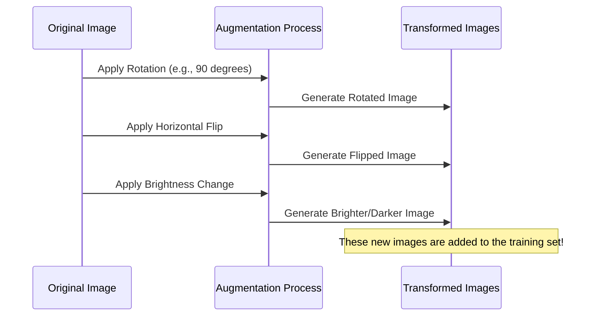
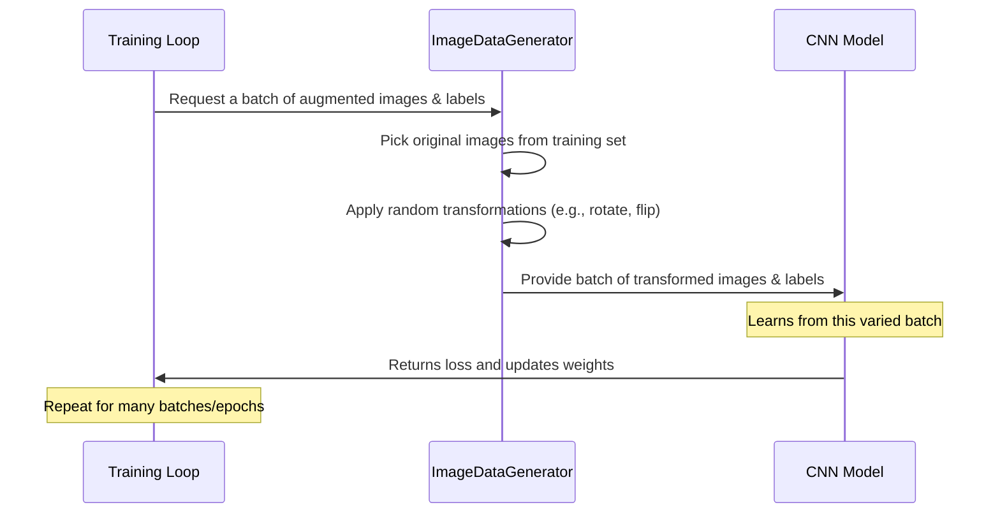

# Chapter 3: Data Augmentation

Welcome back! In [Chapter 1: CNN Model Architecture](01_cnn_model_architecture_.md), we built the "brain" of our project, and in [Chapter 2: Dataset Preparation](02_dataset_preparation_.md), we got our images and labels ready for the CNN to learn from.

Now, imagine our prepared dataset is like a set of flashcards we use to teach our CNN. We have pictures of different tumor types (and no tumor) with their labels. But what if our collection of flashcards isn't very large? A CNN is powerful, but it needs *lots* of examples to learn effectively. If it only sees a small number of images, it might just memorize those specific pictures instead of learning the general features of each tumor type. This is called **overfitting**, and it means our model won't be good at classifying new images it hasn't seen before.

## What if We Don't Have Enough Data?

In the real world, medical images, like brain scans, can be expensive or difficult to obtain in huge quantities. This is a common challenge in many image-based machine learning tasks.

How can we make our CNN learn to recognize a tumor even if it's slightly rotated, zoomed in a bit, or if the lighting is a little different? We need to expose it to these variations during training!

## Data Augmentation to the Rescue!

This is where **Data Augmentation** comes in. It's a smart technique to artificially increase the size and diversity of our training dataset without actually collecting new images. We do this by creating *new* training examples by applying random transformations to our *existing* images.

Think of it like this: If you have a picture of a 'glioma\_tumor', you can create several new pictures from it:
*   A picture of the same 'glioma\_tumor' but slightly rotated.
*   A picture that's flipped horizontally.
*   A picture with slightly adjusted brightness.
*   A picture that's slightly zoomed.

All these variations still show a 'glioma\_tumor', but they look different to the CNN. By training on these augmented images, the model becomes more robust and learns to recognize the tumor regardless of these minor changes.

## How Data Augmentation Helps Our Model

Applying random transformations to the training images serves several important purposes:

1.  **Increases Dataset Size:** This is the most direct benefit. A larger training set generally leads to a better-performing model.
2.  **Adds Diversity:** The transformed images introduce variations in appearance that the model might encounter in real-world data (e.g., slightly tilted scans, different lighting conditions).
3.  **Reduces Overfitting:** By seeing different versions of the same image, the model is less likely to memorize specific examples and more likely to learn generalized features that are truly characteristic of each class. This improves its ability to classify *new, unseen* images accurately.
4.  **Improves Generalization:** A model trained on augmented data is better at handling slight variations in new images, making it more useful in practice.

## Visualizing Data Augmentation

Let's see how a single image can be transformed into multiple new training examples. Imagine we have an original brain scan image.


*   **Explanation:** The diagram shows that starting with one original image, we can apply different types of transformations (Rotation, Flip, Brightness Adjustment, etc.) to create multiple new images. Each of these new images is added to our training data, effectively expanding our dataset and adding variety.

Let's look at some simple examples of transformations using OpenCV (`cv2`), a common image processing library. In a real project, you'd typically use a dedicated deep learning library feature for efficiency, which we'll see in the next chapter.

```python
import cv2 # OpenCV library for image processing
import matplotlib.pyplot as plt # For displaying images
import numpy as np # For numerical operations

# Assume 'img_array' is a NumPy array of your image (e.g., 150x150x3)
# Let's load a dummy image for demonstration
# Replace this with loading an actual image from your dataset if you want to test
try:
    # Attempt to load a dummy image from a common source
    dummy_img_path = 'https://upload.wikimedia.org/wikipedia/commons/thumb/0/0c/Brain_MRI_axial.png/256px-Brain_MRI_axial.png'
    # Use requests and cv2 to load from URL (requires requests library)
    import requests
    from PIL import Image
    from io import BytesIO

    response = requests.get(dummy_img_path)
    response.raise_for_status() # Check for request errors
    img_pil = Image.open(BytesIO(response.content))
    img_array = cv2.cvtColor(np.array(img_pil), cv2.COLOR_RGB2BGR) # Convert to BGR for cv2
    img_array = cv2.resize(img_array, (150, 150)) # Resize to our standard size
    img_array_rgb = cv2.cvtColor(img_array, cv2.COLOR_BGR2RGB) # Convert back to RGB for matplotlib display

except Exception as e:
    print(f"Could not load a dummy image from the web: {e}")
    print("Creating a placeholder image array instead.")
    # Create a simple placeholder image if loading fails
    img_array_rgb = np.zeros((150, 150, 3), dtype=np.uint8)
    img_array_rgb[:,:,:] = [100, 150, 200] # Just a colored square


# Display the original image
plt.figure(figsize=(8, 4))
plt.subplot(1, 3, 1)
plt.imshow(img_array_rgb)
plt.title("Original Image")
plt.axis('off')

# --- Example 1: Rotation ---
# Rotate the image by 90 degrees clockwise
img_rotated = cv2.rotate(img_array_rgb, cv2.ROTATE_90_CLOCKWISE)
plt.subplot(1, 3, 2)
plt.imshow(img_rotated)
plt.title("Rotated 90°")
plt.axis('off')

# --- Example 2: Horizontal Flip ---
# Flip the image horizontally (mirror image)
img_flipped = cv2.flip(img_array_rgb, 1) # 1 means flip horizontally
plt.subplot(1, 3, 3)
plt.imshow(img_flipped)
plt.title("Horizontally Flipped")
plt.axis('off')

plt.tight_layout()
plt.show()
```
*   **Explanation:** This code snippet first tries to load and resize an image (or creates a placeholder if that fails). Then, it uses `cv2.rotate` to create a 90-degree rotated version and `cv2.flip` to create a horizontally mirrored version of the original image. It displays the original and the two transformed versions side-by-side to show how augmentation creates diverse new examples from a single image. These transformed images would then be added to the training dataset alongside the original.

Other common transformations include:
*   **Vertical Flip:** Flipping the image upside down.
*   **Shifting:** Moving the image content slightly up/down/left/right.
*   **Zooming:** Slightly zooming in or out of the image.
*   **Brightness/Contrast Adjustment:** Making the image brighter or darker.

## Data Augmentation in the Project Code

Looking at the provided code ([`classification.py`](classification.py) or [`compiled_layered_model.ipynb`](compiled_layered_model.ipynb)), you can see that data augmentation using `ImageDataGenerator` is mentioned and used, specifically for the 'no\_tumor' class:

```python
# ... (loading and resizing code) ...

# Inside the loop for loading training data:
for i in labels: # Labels include 'glioma_tumor', 'no_tumor', etc.
    folderPath = os.path.join('D:/PBS/labelled Dataset','Training',i)
    for j in tqdm(os.listdir(folderPath)):
        img = cv2.imread(os.path.join(folderPath,j))
        img = cv2.resize(img,(image_size, image_size))

       #selecting only no tumor images sorting by labels
        if i=='no_tumor':
            data = img_to_array(img)
            #expand ranks of the images
            samples = expand_dims(data, 0)

            # create image data augmentation generator
            datagen = ImageDataGenerator(rotation_range=90 , horizontal_flip=True)

            # prepare iterator
            it = datagen.flow(samples, batch_size=1)

           #generate samples and plot
            for k in range(2): # Generate 2 augmented samples per original 'no_tumor' image
                batch = it.next()
                image = batch[0].astype('uint8')
                X_train.append(image)
                y_train.append(i)
        else: # For other classes, just add the original image
            X_train.append(img)
            y_train.append(i)

# ... (loading testing data, shuffling, splitting, encoding) ...
```
*   **Explanation:** This snippet shows that when loading the training data, for images specifically from the 'no\_tumor' folder, they are augmented. Two new versions (`k in range(2)`) are generated for each original 'no\_tumor' image using `ImageDataGenerator` with rotation and horizontal flip, and these augmented images are added to the `X_train` and `y_train` lists alongside the original images from all classes.

This specific choice to only augment the 'no\_tumor' class suggests that this class might have fewer examples than the tumor classes in the original dataset. Augmenting it helps **balance the dataset**, ensuring the CNN doesn't disproportionately learn from the more numerous tumor examples.

While this code performs augmentation upfront during data loading, a more common and often memory-efficient approach is to apply augmentation *dynamically* during the training process. We will dive deeper into how `ImageDataGenerator` works and how to use it for dynamic augmentation in the next chapter.

## How Data Augmentation is Used During Training (High-Level Flow)

Instead of creating all augmented images and storing them (which can take up a lot of memory), data augmentation is usually applied on-the-fly.


*   **Explanation:** During training, instead of feeding the original images directly, the training loop asks an `ImageDataGenerator` to prepare a batch. The generator takes original images, applies random transformations *to that specific batch*, and then provides the varied batch to the CNN. This ensures that the CNN sees slightly different versions of the images in each training "epoch" (pass through the dataset) and we don't need to pre-generate and store a massive augmented dataset.

## Conclusion

In this chapter, we learned the importance of Data Augmentation as a technique to combat limited data and prevent overfitting in image classification. We saw how applying random transformations like rotation and flipping can create new, diverse training examples from existing images. We also briefly saw how this is applied in our project code to balance the dataset and how it can be conceptualized as a dynamic process during training.

Now that we understand the *why* and *what* of Data Augmentation, the next chapter will delve into the *how*, focusing on using Keras's powerful `ImageDataGenerator` to implement these techniques efficiently.

[Keras ImageDataGenerator](04_keras_imagedatagenerator_.md)
