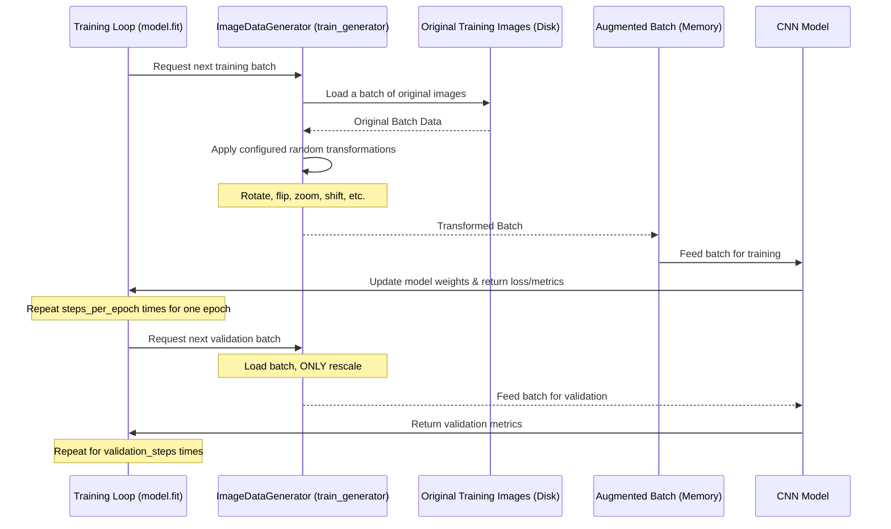

# Chapter 4: Keras ImageDataGenerator

Welcome back! In [Chapter 3: Data Augmentation](03_data_augmentation_.md), we learned *why* data augmentation is important – it helps us create more varied training data to prevent our Convolutional Neural Network (CNN) ([Chapter 1: CNN Model Architecture](01_cnn_model_architecture_.md)) from simply memorizing the training images and becoming better at classifying new, unseen brain scans.

We saw how transformations like rotating, flipping, or zooming can artificially increase the size and diversity of our prepared dataset ([Chapter 2: Dataset Preparation](02_dataset_preparation_.md)). But generating *all* possible augmented versions of every training image and storing them would take up a massive amount of memory and disk space!

So, how do we apply these helpful transformations efficiently, especially when training deep learning models that need lots of data?

## The Problem: Storing Tons of Augmented Images is Impractical

Imagine you have 1000 training images. If you create 10 augmented versions of each (one rotation, one flip, etc.), you suddenly have 10,000 images! If you create 50 augmented versions, you have 50,000 images! Storing all of these could easily fill up your computer's hard drive, especially for high-resolution images.

Even if you could store them, loading all that data into memory during training would be slow and potentially impossible depending on your hardware.

## Keras ImageDataGenerator: Data Augmentation On-the-Fly

This is exactly the problem that Keras's `ImageDataGenerator` solves. Instead of creating and storing all the augmented images beforehand, `ImageDataGenerator` acts like a **smart factory** or a **lazy chef**.

It doesn't cook all the meals (create all augmented images) at once. Instead, when your CNN model is hungry for a batch of training data, the `ImageDataGenerator`:

1.  Takes a few original images from your training set.
2.  Applies random transformations (like rotating, flipping, zooming) *to just those few images*.
3.  Gives this newly created, augmented batch to the CNN for training.
4.  For the next batch, it repeats the process, potentially creating different random transformations even on the *same original images*.

This happens dynamically during the training process. This way, the CNN sees slightly different variations of the training data in each training "epoch" (a full pass through the dataset) without us needing to store all those variations. This saves a huge amount of memory and disk space!

## How to Use ImageDataGenerator

Using `ImageDataGenerator` involves two main steps:

1.  **Creating the Generator:** You instantiate `ImageDataGenerator` and tell it *what kinds* of random transformations you want to apply.
2.  **Using the Generator's `flow()` or `flow_from_directory()` Method:** You tell the generator *where* your original images are (either directly as arrays or in folders) and how to generate batches of augmented data from them.

For a project like ours, where images are organized in folders by class (like 'Training/glioma_tumor', 'Training/no_tumor'), the `flow_from_directory()` method is incredibly convenient. It automatically reads the images, infers their labels from the folder names, resizes them, and generates batches of augmented data.

Let's see how to create a generator and configure some common transformations.

```python
from tensorflow.keras.preprocessing.image import ImageDataGenerator

# Create an ImageDataGenerator instance for training data
# We specify the range/parameters for random transformations
train_datagen = ImageDataGenerator(
    rescale=1./255,          # Scale pixel values from [0, 255] to [0, 1]
    rotation_range=20,       # Randomly rotate images by up to 20 degrees
    width_shift_range=0.1,   # Randomly shift the width of images by up to 10%
    height_shift_range=0.1,  # Randomly shift the height of images by up to 10%
    shear_range=0.1,         # Apply shear transformation (like tilting the image)
    zoom_range=0.1,          # Randomly zoom inside images
    horizontal_flip=True,    # Randomly flip images horizontally
    vertical_flip=True,      # Randomly flip images vertically (caution for some tasks!)
    brightness_range=[0.8, 1.2], # Randomly adjust brightness
    fill_mode='nearest'      # How to fill in new pixels created by transformations
)

# We'll also create a generator for validation/test data,
# but ONLY with rescaling (augmentation should only be on training data)
validation_datagen = ImageDataGenerator(rescale=1./255)
test_datagen = ImageDataGenerator(rescale=1./255) # Same for test data
```
*   **Explanation:**
    *   We import `ImageDataGenerator`.
    *   We create an instance `train_datagen`. The parameters define the *types* of random transformations the generator can apply to an image in a batch.
    *   `rescale=1./255` is a very important preprocessing step: it scales the pixel values from the typical 0-255 range to a 0-1 range, which is often better for neural networks.
    *   Other parameters (`rotation_range`, `horizontal_flip`, etc.) specify the *intensity* or *probability* of each transformation. `fill_mode='nearest'` determines how missing pixels (e.g., after rotation) are handled – they'll be filled with the nearest pixel value.
    *   Crucially, we create separate generators for validation and test data (`validation_datagen`, `test_datagen`) and *only* apply `rescale=1./255`. **You should generally not apply data augmentation transformations to your validation or test sets.** These sets are used to evaluate how well your model generalizes to *real*, untransformed data.

## Generating Batches with `flow_from_directory()`

Now that we have the generators configured, we use `flow_from_directory()` to point them to our data folders.

```python
# Assuming your data is organized like this:
# your_dataset_folder/
#   Training/
#     glioma_tumor/
#     meningioma_tumor/
#     no_tumor/
#     pituitary_tumor/
#   Testing/
#     glioma_tumor/
#     ...etc

data_directory = 'D:/PBS/labelled Dataset' # Replace with your actual data path
image_size = (150, 150) # The target size for resizing images

# Use flow_from_directory to generate batches from folders
train_generator = train_datagen.flow_from_directory(
    directory=f'{data_directory}/Training', # Path to the training data folder
    target_size=image_size,             # Resize images to this size
    batch_size=32,                      # Number of images per batch
    class_mode='categorical',           # For multi-class classification (like ours)
    shuffle=True                        # Shuffle the order of batches each epoch
)

validation_generator = validation_datagen.flow_from_directory(
    directory=f'{data_directory}/Testing', # Path to the testing/validation data folder
    target_size=image_size,             # Resize images
    batch_size=32,                      # Number of images per batch
    class_mode='categorical',           # For multi-class classification
    shuffle=False                       # Don't shuffle validation data (optional, for consistency)
)
```
*   **Explanation:**
    *   `directory`: Tells the generator where to find the images. `flow_from_directory` expects subfolders within this directory, where each subfolder name is a class label.
    *   `target_size`: All images read by the generator will be resized to this (height, width). This is crucial because CNNs need fixed-size inputs, as discussed in [Chapter 1: CNN Model Architecture](01_cnn_model_architecture_.md). We use (150, 150) to match our model architecture.
    *   `batch_size`: The number of images (and their corresponding labels) to generate in each batch. Our CNN will process data in these batches during training ([Chapter 1: CNN Model Architecture](01_cnn_model_architecture_.md)).
    *   `class_mode='categorical'`: This tells the generator that the labels should be returned in a one-hot encoded format, which matches the output of our CNN's final `Dense` layer with `softmax` activation ([Chapter 1](01_cnn_model_architecture_.md) and [Chapter 2](02_dataset_preparation_.md)).
    *   `shuffle=True` (for training) ensures the data is mixed up in each epoch, which helps prevent the model from learning the order of data. `shuffle=False` (for validation) is common to evaluate performance consistently across epochs.

The `train_generator` and `validation_generator` are now ready to be used directly with the model's `fit()` method.

## Visualizing Augmented Images from the Generator

We can use a generator to get a batch and visualize the augmented images it produces.

```python
import matplotlib.pyplot as plt

# Get one batch of augmented images and labels
images, labels = next(train_generator)

# Display the first few images from the batch
plt.figure(figsize=(10, 10))
for i in range(9): # Display up to 9 images from the batch
    if i < len(images): # Ensure we don't go out of bounds if batch size is smaller
        plt.subplot(3, 3, i + 1)
        plt.imshow(images[i])
        # Find the original label string from the one-hot encoded label
        # (Requires having the list of original labels, e.g., labels_list = ['glioma', ...])
        # Let's skip displaying the label here for simplicity in this minimal example
        plt.title(f'Augmented Image {i+1}')
        plt.axis('off')
plt.tight_layout()
plt.show()
```
*   **Explanation:** We call `next(train_generator)` to get the next batch of data. This is where the random transformations specified when creating `train_datagen` are applied to a batch of original images. We then plot a few images from this batch to see the effects of the augmentation.

## Using the Generator for Model Training

When using `ImageDataGenerator`, you typically pass the generator directly to the `model.fit()` method (in older Keras versions, this was `model.fit_generator()`).

```python
# Assuming 'model' is your compiled CNN model from Chapter 1
# Assuming train_generator and validation_generator are created as shown above

# Determine how many batches make up one epoch for training
# This is total number of training images / batch size
steps_per_epoch = train_generator.samples // train_generator.batch_size

# Determine steps for validation (optional, but good practice)
validation_steps = validation_generator.samples // validation_generator.batch_size


# Train the model using the generators
history = model.fit(
    train_generator,        # Pass the training generator
    steps_per_epoch=steps_per_epoch, # Number of batches per epoch
    epochs=20,              # Number of training epochs (passes through the data)
    validation_data=validation_generator, # Pass the validation generator
    validation_steps=validation_steps     # Number of validation batches
    # You can add callbacks here, like EarlyStopping (covered in Chapter 6)
)

# Note: The project code snippet (classification.py/compiled_layered_model.ipynb)
# does not use fit_generator directly on the full dataset.
# It uses ImageDataGenerator.flow() to augment *only* 'no_tumor' images
# and appends them to the X_train, y_train lists upfront,
# then trains using model.fit(X_train, y_train).
# The dynamic on-the-fly method with flow_from_directory and fit is more common
# and generally preferred for its memory efficiency with large datasets.
```
*   **Explanation:**
    *   `model.fit()`: We pass the `train_generator` as the first argument. Keras now knows to get its training data batches from this generator.
    *   `steps_per_epoch`: Since the generator provides batches indefinitely, Keras needs to know how many batches constitute one "epoch" (a full pass through the entire training dataset). We calculate this by dividing the total number of training samples by the batch size.
    *   `epochs`: The number of times the model will iterate over the entire training dataset (using the specified number of batches per epoch).
    *   `validation_data`: We pass the `validation_generator` here to provide validation data for Keras to evaluate the model's performance on unseen data after each epoch.
    *   `validation_steps`: Similar to `steps_per_epoch`, this tells Keras how many batches to draw from the validation generator for evaluation.

By using generators this way, the data augmentation is applied just-in-time, batch by batch, making the training process much more memory-efficient.

## How Data Augmentation with `ImageDataGenerator` Works (Under the Hood)

Let's visualize the dynamic process:


*   **Explanation:** The `model.fit` method orchestrates the training. In each step within an epoch, it asks the `ImageDataGenerator` for a batch. The generator loads some original images from disk, randomly transforms them (except for validation/test generators), and provides this modified batch to the CNN. The CNN learns from this augmented data, updates its internal parameters, and the process repeats. This ensures the model sees a wide variety of images without needing to store them all explicitly.

## Advantages of using `ImageDataGenerator`

Using `ImageDataGenerator` offers several key benefits, especially for image classification tasks with limited data:

| Feature             | Benefit                                                                 |
| :------------------ | :---------------------------------------------------------------------- |
| **On-the-Fly**      | Saves memory and disk space by not pre-generating all augmented images. |
| **Regularization**  | Helps prevent overfitting by showing varied examples.                   |
| **Efficiency**      | Can load and process images in parallel using multi-processing.         |
| **Convenience**     | `flow_from_directory` simplifies loading from folder structures.        |
| **Standardization** | Handles resizing and pixel scaling consistently.                        |

While the code snippet in the project itself uses `ImageDataGenerator.flow()` to augment a specific subset of data upfront (`no_tumor` class) before creating the final NumPy arrays for training, the concept of `ImageDataGenerator` is most powerful when used dynamically with `.fit()` as described above. The project's approach might have been chosen for specific reasons (e.g., controlling the exact number of augmented samples added for balancing), but the dynamic method is generally preferred for its memory efficiency.

## Conclusion

In this chapter, we explored Keras `ImageDataGenerator`, a powerful utility for performing data augmentation efficiently in deep learning projects. We learned how it generates batches of randomly transformed images on-the-fly during training, saving valuable memory and disk space. We saw how to configure various transformations and use the generator to feed data to our CNN model.

Now that our data preparation and augmentation are covered, we have everything we need to train our CNN model effectively. The next chapter will guide you through the model training process using the prepared data.

[Model Training](05_model_training_.md)
