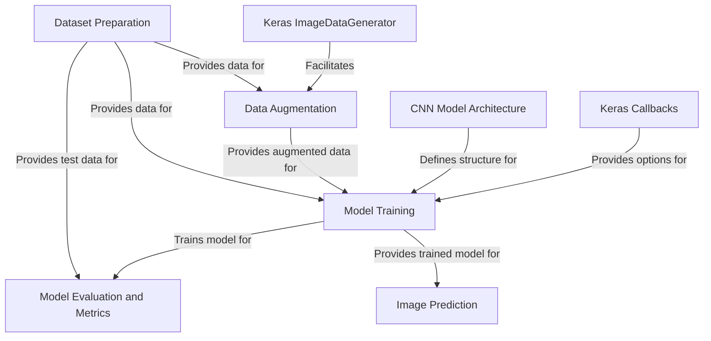

# Tutorial: brain-tumors-classification

This project focuses on classifying brain tumors from MRI images using a **Convolutional Neural Network (CNN)**. It involves preparing the *image dataset*, optionally applying *data augmentation* to increase variability, defining and training the *CNN model*, and finally *evaluating* its performance and using it for *predictions* on new images. Key tools from the Keras library, like `ImageDataGenerator` and `Callbacks`, are utilized throughout the process.

## Visual Overview

## Chapters

1. [CNN Model Architecture
](01_cnn_model_architecture_.md)
2. [Dataset Preparation
](02_dataset_preparation_.md)
3. [Data Augmentation
](03_data_augmentation_.md)
4. [Keras ImageDataGenerator
](04_keras_imagedatagenerator_.md)
5. [Model Training
](05_model_training_.md)
6. [Keras Callbacks
](06_keras_callbacks_.md)
7. [Model Evaluation and Metrics
](07_model_evaluation_and_metrics_.md)
8. [Image Prediction
](08_image_prediction_.md)
